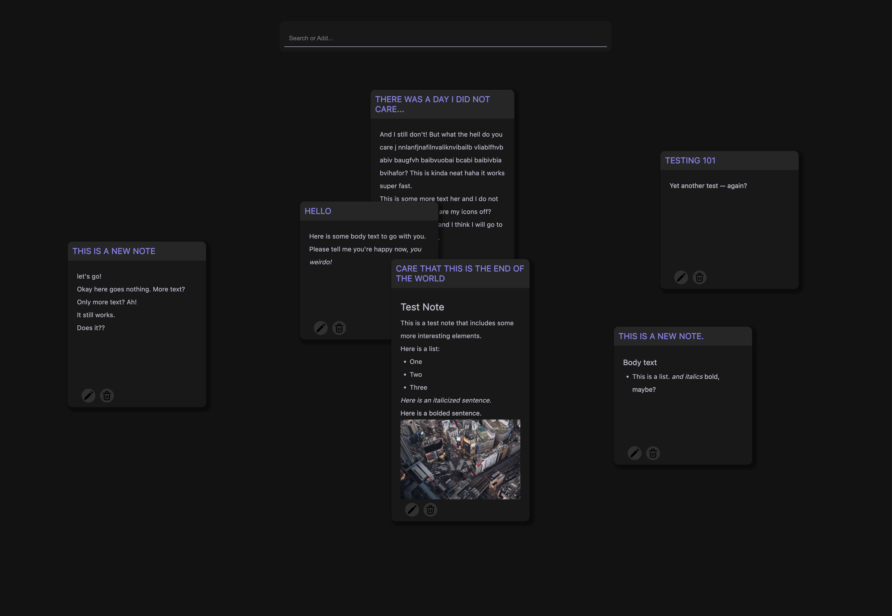

# CS52 Lab 3: FireNotes

[deployed url](https://firenotes-siavava.onrender.com/)

## What Worked Well

Firebase is pretty easy to use.

## What Didn't

Nothing

## Extra Credit

Rudimentary extension: I added a basic search feature that highlights
which notes contain the search term.

## Screenshots

### Main Functionality

### [Search demo](https://www.loom.com/share/54e50eccb5fd4801aba995794728bbc5)

